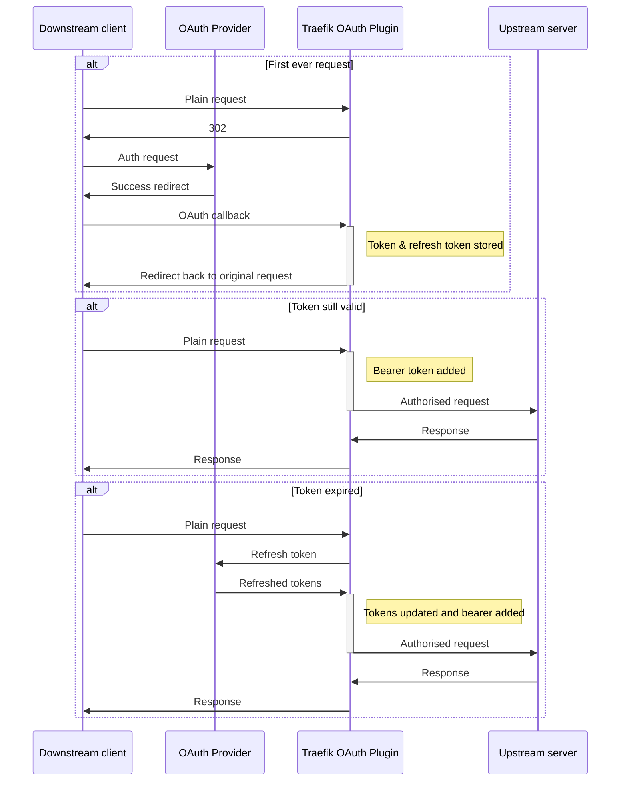

# Upstream OAuth - Traefik Middleare

This middleware adds OAuth headers to your requests so that for the upstream (service) the request is  
OAuth-authenticated. With other middleware you can configure any kind of downstream (client) authentication 
(E.g., [Basic Auth](https://doc.traefik.io/traefik/middlewares/http/basicauth/)) or leave it open to the
internet! (not recommended)

After the client has signed in, tokens are kept cached and are automatically refreshed. 

## Typical flow

## Config

You can set up different upstream OAuths by configuring different middlewares, or you can configure one middleware
and reuse it with multiple routers/services.

[Config example](docker-dev/dynamic-config-example/oauthup.yml)

## Development

This repo is GitPod friendly.
