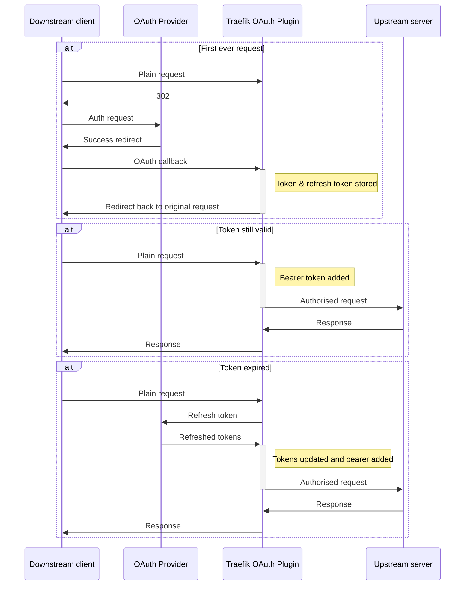

# Upstream OAuth - Traefik Middleare

Manage OAuth for the upstream.

## Typical flow

```mermaid
sequenceDiagram
  participant B as Downstream client
  participant O as OAuth Provider
  participant P as Traefik OAuth Plugin
  participant U as Upstream server

  alt First ever request
    B->>P: Plain request
    P->>B: 302
    B->>O: Auth request
    O->>B: Success redirect
    B->>+P: OAuth callback
    Note right of P: Token & refresh token stored
    P->>-B: Redirect back to original request
  end

  alt Token still valid
    B->>+P: Plain request
    Note right of P: Bearer token added
    P->>-U: Authorised request
    U->>P: Response
    P->>B: Response
  end

  alt Token expired
    B->>P: Plain request
    P->>O: Refresh token
    O->>+P: Refreshed tokens
    Note right of P: Tokens updated and bearer added
    P->>-U: Authorised request
    U->>P: Response
    P->>B: Response
  end
  
```
